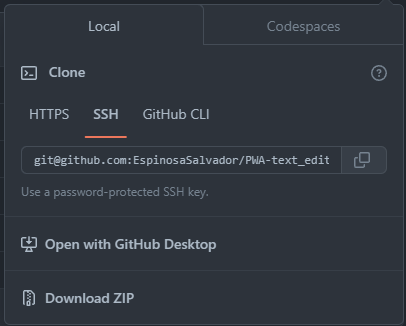
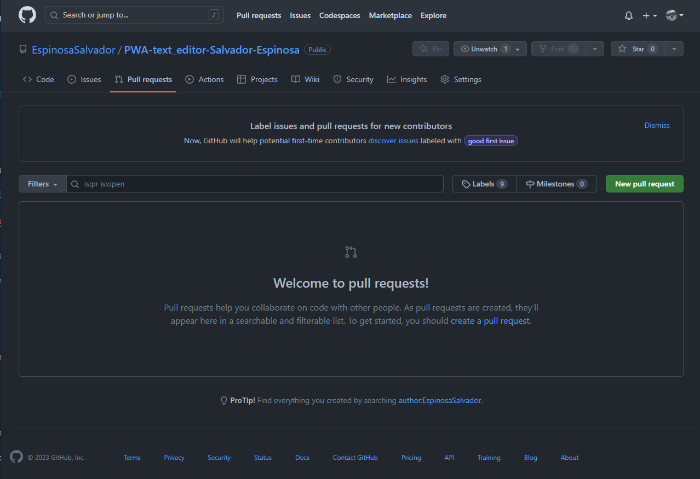
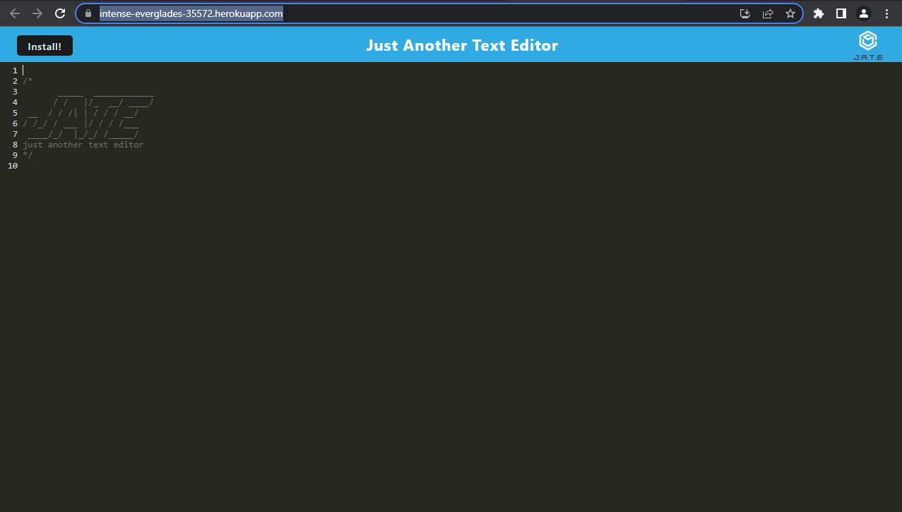
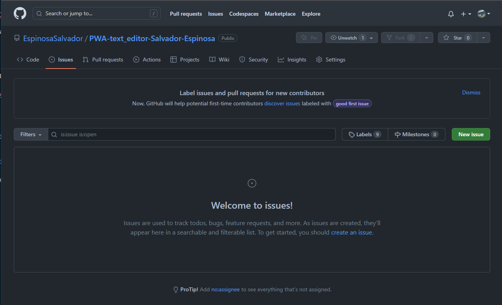

# PWA-text-editor-Salvador-Espinosa

## Table of Content

- [Introduction](#introduction)
- [Features](#features)
- [Requirements](#requirements)
- [Installation](#installation)
- [Configuration](#configuration)
- [What you should be able to see](#what-you-should-be-able-to-see)
- [Troubleshooting](#troubleshooting)
- [Next Phase Development](#next-phase-development)
- [FAQ (Frecuently Asked Questions)](#faq-frecuentrly-asked-questions)
- [Team](#team)

## Introduction

So, as part of our course, we created this awesome web application called a Progressive Web App (PWA). It's a text editor that runs right in your browser, and it's super cool because it incorporates all the concepts we learned during the course.

First of all, this text editor is a single-page application, which means it doesn't require multiple page reloads. It's all smooth and seamless, just like the apps you use on your phone. And the best part is that it meets the criteria of a Progressive Web App, which means it can work even when you're offline. So, you don't have to worry about losing your work if you suddenly lose internet connection.

To handle the data retrieval and storage, we used a special package called "idb." It's a lightweight wrapper around the IndexedDB API and is widely used by big companies like Google and Mozilla. This package made it easier for us to work with the database and ensured that our text editor performs well and efficiently.

- [Link to my Github Repository](https://github.com/EspinosaSalvador/PWA-text_editor-Salvador-Espinosa)
- [Link to application running](https://intense-everglades-35572.herokuapp.com/)

## Features

- Runs in browser
- Download the components and be able to use it without internet

## Installation

To install this project please proceed to my [GitHub Repository](https://github.com/EspinosaSalvador/E-commerce-Back-End-by-Salvador)

you should be able to see this,


Click on code as shown in the image



Copy the SSH key or the HTTPS key and open.

- Terminal
- Git bash
- CMD

either one of this will work. please proceed to the terminal an put in your Terminal,

```
git clone git@github.com:EspinosaSalvador/PWA-text_editor-Salvador-Espinosa.git
```

and now you have a copy of the code.

you can work/play/use the app

## Configuration

If you want to do any configurations on this project please open a new branch you can do this by putting the following code in your terminal,

```
git checkout -b ＜new-branch＞
```

switch branches putting the following code on your terminal.

```
git checkout ＜branchname＞
```

If you want to show us your code and merge please open a pull request on

[Github](https://github.com/EspinosaSalvador/PWA-text_editor-Salvador-Espinosa/pulls).



## What you should be able to see

To start this app please use npm i to install the dependencies that we have on the package.json after that please enter to your msql password and user so you can download the database.

```
npm i
```

from there please see my package.json to see the steps that you need to follow."



please install jade from there and have please let me know if we need to modify or fix bugs.

## Troubleshooting

The PWA-text_editor-Salvador-Espinosa is in version 1.0, please let me know if there are anybug in the webpage by issuing it in [Github](https://github.com/EspinosaSalvador/PWA-text_editor-Salvador-Espinosa/issues)



## Next Phase Development

This are will be updated depending on the feedback from the users.

## FAQ (Frecuentrly Asked Questions)

We will update this part when we have some frequently asked question.

## Team

- Salvador Espinosa Valdez
